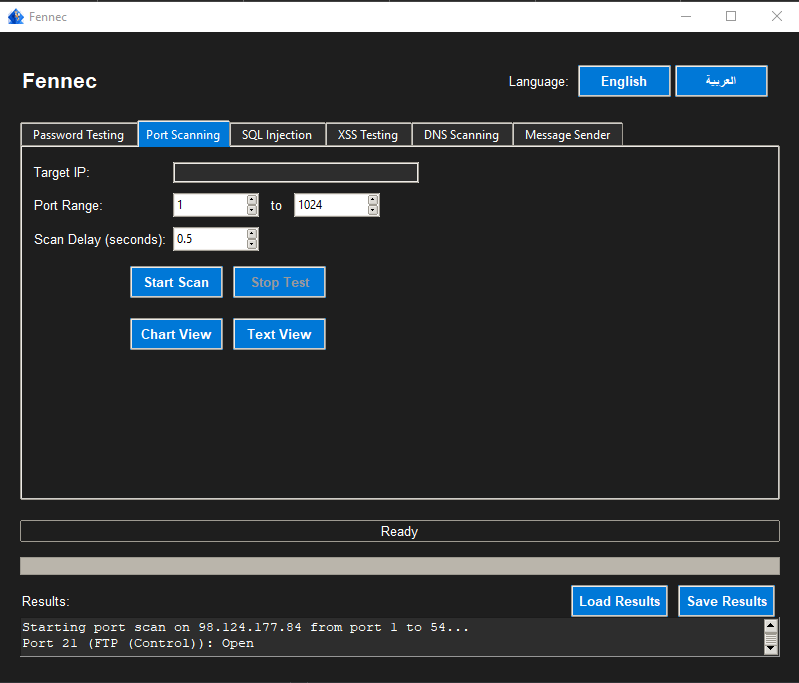

Here is a complete README.md file for your "Fennec" (الفنك) tool, including spots for two images. Please upload your images (for example, logo.png and screenshot.png) to the images/ directory in your repository and rename them if needed.

---

# الفنك - Fennec




## 🇸🇦 الفنك - أداة اختبار أمان متكاملة

### نظرة عامة
**الفنك** هي أداة متعددة الوظائف لاختبار أمان تطبيقات الويب والشبكات بواجهة رسومية حديثة وسهلة الاستخدام. توفر الأداة إمكانيات متقدمة لفحص كلمات المرور، فحص المنافذ، اختبار حقن SQL، اختبار XSS، فحص سجلات DNS، بالإضافة لإرسال الرسائل بشكل آلي عبر تحديد موقع الإدخال.

### المميزات
- واجهة رسومية متطورة مع دعم الوضع الليلي.
- دعم اللغتين العربية والإنجليزية مع تبديل فوري للغة.
- فحص كلمات المرور (Brute Force) باستخدام قوائم مخصصة.
- فحص المنافذ المفتوحة على الشبكات.
- اختبار ثغرات SQL Injection.
- اختبار ثغرات XSS.
- فحص سجلات DNS بأنواعها المتعددة.
- إرسال رسائل متكررة لأي تطبيق أو موقع عبر تحديد موقع الإدخال.
- حفظ وقراءة نتائج الفحوصات.
- عرض النتائج نصيًا أو بشكل رسومي (Pie Chart).
- زر إيقاف طارئ (ESC).

### المتطلبات
- Python 3.8 أو أحدث
- المكتبات:  
  `tkinter`, `matplotlib`, `pyautogui`, `keyboard`, `requests`, `dnspython`, `beautifulsoup4`

لتثبيت المتطلبات:
```bash
pip install matplotlib pyautogui keyboard requests dnspython beautifulsoup4
```

### الاستخدام
```bash
python message_app.py
```

### التحذير
هذه الأداة تعليمية ويجب استخدامها في بيئة اختبارية أو بإذن صريح فقط. أي استخدام غير قانوني يعرضك للمساءلة.

---

## 🇬🇧 Fennec - Comprehensive Security Testing Tool


### Overview
**Fennec** is a versatile GUI-based toolkit for web and network security testing. It offers advanced features for password brute forcing, port scanning, SQL Injection testing, XSS testing, DNS record scanning, and automated message sending.

### Features
- Modern GUI with dark theme support.
- Instant language switching (Arabic & English).
- Password brute force testing with custom wordlists.
- Network port scanner.
- SQL Injection vulnerability tester.
- XSS vulnerability tester.
- DNS record scanner for multiple record types.
- Automated message sender for any app or site (set input position).
- Save and load scan results.
- Results view as text or pie chart.
- Emergency stop with ESC key.

### Requirements
- Python 3.8+
- Libraries:  
  `tkinter`, `matplotlib`, `pyautogui`, `keyboard`, `requests`, `dnspython`, `beautifulsoup4`

Install requirements via:
```bash
pip install matplotlib pyautogui keyboard requests dnspython beautifulsoup4
```

### Usage
```bash
python message_app.py
```

### Disclaimer
This tool is for educational purposes only. Use only in test environments or with explicit permission. Unauthorized usage may be illegal.

---

ه.
